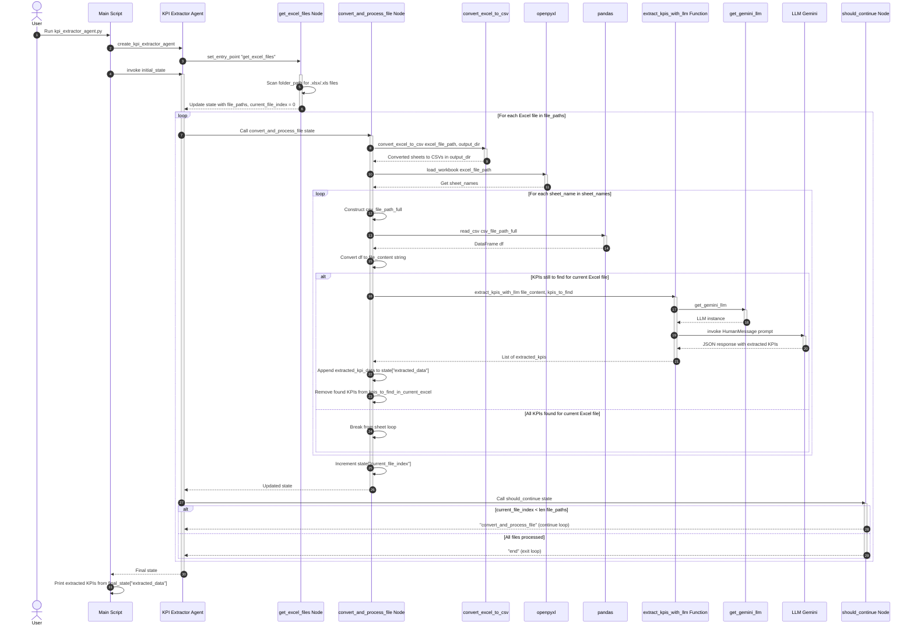

# KPI Extractor Agent Flow

This document explains the operational flow of the `kpi_extractor_agent.py` script, which is designed to extract Key Performance Indicators (KPIs) from Excel files. The script utilizes LangGraph to orchestrate a multi-step process, handling file conversion, content extraction, and LLM-based KPI identification.

## Overall Flow

The agent processes Excel files one by one. For each Excel file, it converts all sheets into separate CSV files and then iterates through these CSVs to extract the specified KPIs using a Large Language Model (LLM).

## Sequence Diagram

## Explanation of Components and Flow:

1.  **User Initiation**: The process begins when the user runs the `kpi_extractor_agent.py` script.
2.  **Agent Initialization**: The `create_kpi_extractor_agent()` function sets up the LangGraph workflow, defining the nodes (`get_excel_files`, `convert_and_process_file`) and the entry point.
3.  **`get_excel_files` Node**:
    *   This is the starting point of the workflow.
    *   It scans the `folder_path` (provided in the initial state) for all Excel files (`.xlsx`, `.xls`).
    *   It updates the agent's state with a list of `file_paths` and initializes `current_file_index` to 0.
4.  **`convert_and_process_file` Node**:
    *   This node is responsible for handling a single Excel file at a time.
    *   It checks if there are more Excel files to process based on `current_file_index`.
    *   **Excel to CSV Conversion**: It calls `convert_excel_to_csv` (from `src/utlis/excel_to_csv_utils.py`) to convert all sheets of the current Excel file into separate CSV files within a `converted_csvs` subdirectory.
    *   **Sheet Name Retrieval**: It uses `openpyxl` to load the Excel workbook and get all sheet names. This is crucial because `convert_excel_to_csv` creates one CSV per sheet, named `original_filename_sheetname.csv`.
    *   **Iterating through CSVs (Sheets)**: It then loops through each `sheet_name` obtained from the Excel file.
        *   For each sheet, it constructs the full path to the corresponding CSV file.
        *   It reads the CSV content into a Pandas DataFrame and converts it to a string (`file_content`) for the LLM.
        *   **KPI Extraction**: It calls the `extract_kpis_with_llm` function, passing the CSV content and the list of KPIs to find.
            *   `extract_kpis_with_llm` initializes the LLM (Gemini) using `get_gemini_llm()` (from `src/config/llm_config.py`).
            *   It constructs a detailed prompt for the LLM, including the file content and the KPIs to extract.
            *   It invokes the LLM and parses the JSON response to get the extracted KPI data.
        *   The extracted KPIs are appended to the `extracted_data` list in the agent's state. KPIs that have been found are removed from `kpis_to_find_in_current_excel` to optimize subsequent LLM calls for the same Excel file.
    *   After processing all sheets (or finding all required KPIs) for the current Excel file, `current_file_index` is incremented.
5.  **`should_continue` Node (Conditional Edge)**:
    *   This node acts as a decision point in the LangGraph workflow.
    *   It checks if `current_file_index` is less than the total number of `file_paths`.
    *   If true, it returns `"convert_and_process_file"`, causing the workflow to loop back and process the next Excel file.
    *   If false (all Excel files have been processed), it returns `"end"`, terminating the workflow.
6.  **Final Output**: Once the workflow ends, the main script prints all the collected `extracted_data`.