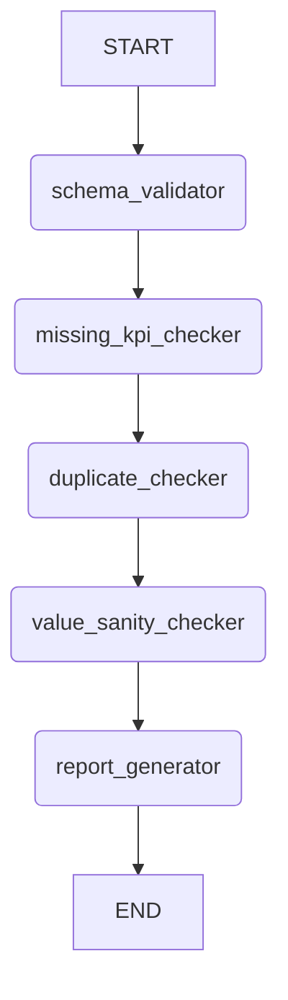
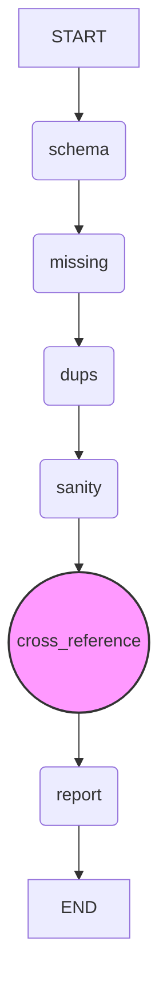

# KPI Agent Verification Process

The verification in [`src/o3/kpi_agent.py`](src/o3/kpi_agent.py:1) is performed through a series of nodes in a LangGraph `StateGraph`. This graph processes the extracted KPI records and identifies potential issues through the following steps:

### 1. `VerificationState`

This `TypedDict` defines the shared state passed between the verification nodes. It includes:
- `df`: The DataFrame containing the data from which KPIs were extracted.
- `target_kpis`: A list of KPI names that were targeted for extraction.
- `extracted`: A list of dictionaries, where each dictionary represents an extracted KPI record (conforming to `KPIRecord` schema).
- `issues`: A list of strings to collect any issues found during verification.

### 2. Verification Nodes

The `build_verification_graph` function (lines 253-268) defines the sequence of verification steps. Each node in this graph performs a specific check:

*   **`schema_validator`**:
    *   **Purpose**: Ensures that each extracted KPI record conforms to the `KPIRecord` Pydantic schema.
    *   **Mechanism**: It iterates through the `extracted` records and attempts to validate each one using `KPIRecord.model_validate(rec)`. If a `ValidationError` occurs, an issue message is appended to the `issues` list.

*   **`missing_kpi_checker`**:
    *   **Purpose**: Checks if all the `target_kpis` (KPIs that were supposed to be extracted) are actually present in the `extracted` records.
    *   **Mechanism**: It compares the lowercase names of the `target_kpis` with the lowercase names of the `extracted` KPIs. Any `target_kpis` not found in the `extracted` set are reported as missing.

*   **`duplicate_checker`**:
    *   **Purpose**: Identifies if there are any duplicate KPI/header pairs in the extracted records. A duplicate could indicate an error in extraction or an ambiguous entry.
    *   **Mechanism**: It uses a `set` to keep track of `(name.lower(), header)` tuples. If a tuple is encountered again, it's marked as a duplicate.

*   **`value_sanity_checker`**:
    *   **Purpose**: Performs a basic sanity check on the extracted numeric values. It flags values that are `NaN` (Not a Number) or are excessively large (above a `large_threshold`, defaulting to 1e12).
    *   **Mechanism**: It iterates through the `extracted` records, checks the `value` field for `NaN` or values exceeding the threshold, and reports any "implausible numbers."

*   **`report_generator`**:
    *   **Purpose**: Generates a final report based on the issues collected during the previous verification steps.
    *   **Mechanism**: If the `issues` list in the `VerificationState` is not empty, it prints a "Verification failed" message followed by each identified issue. Otherwise, it prints "Verification passed with no issues."

### 3. Verification Graph Flow

The `build_verification_graph` function (lines 253-268) orchestrates these checks sequentially:

Each node receives the `VerificationState`, performs its check, potentially adds issues to the `issues` list within the state, and then passes the updated state to the next node.

### 4. Execution in `if __name__ == "__main__":` block

In the main execution block (lines 277-322), after the KPI extraction is complete:
1.  The `verification_graph` is built.
2.  The `verification_graph.invoke()` method is called with an initial `VerificationState` containing:
    *   `df`: A concatenated DataFrame of all processed CSVs.
    *   `target_kpis`: The list of KPIs the user wanted to extract.
    *   `extracted`: The list of KPI records obtained from the extraction process.
3.  The graph then executes the verification nodes in sequence, collecting all issues.
4.  Finally, the `report_generator` node prints the outcome of the verification.
## Proposed Enhancement: Cross-Referencing with Source Data

The current verifier checks the internal consistency of the extracted data but does not confirm its accuracy against the original source CSV. To address this, a new verification step will be added to cross-reference the extracted values with the source data.

### 1. New Verification Node: `cross_reference_checker`

A new function, `cross_reference_checker`, will be added to the verification graph.

**Logic:**
For each extracted KPI record, the function will:
1.  Use the `row` and `header` coordinates from the extracted record to locate the exact cell in the source DataFrame (`df`).
2.  Parse the original value from that cell, handling cleaning and conversion to a numeric type.
3.  Compare the source value with the `value` extracted by the LLM.
4.  If the values do not match, it will flag a "Value mismatch" issue.
5.  It will also handle cases where the coordinates provided by the LLM are invalid.

### 2. Updated Verification Graph

The new `cross_reference_checker` node will be integrated into the verification graph after the initial data integrity checks but before the final report is generated.

The new flow will be as follows:

